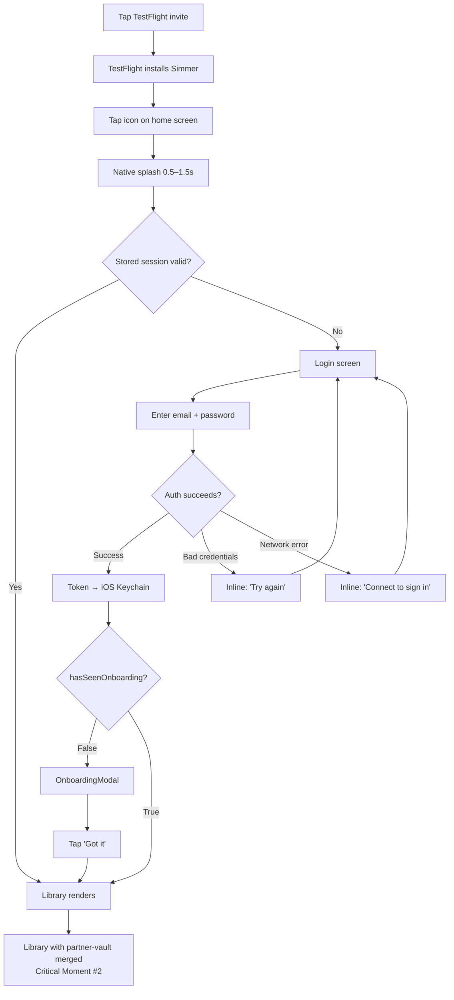
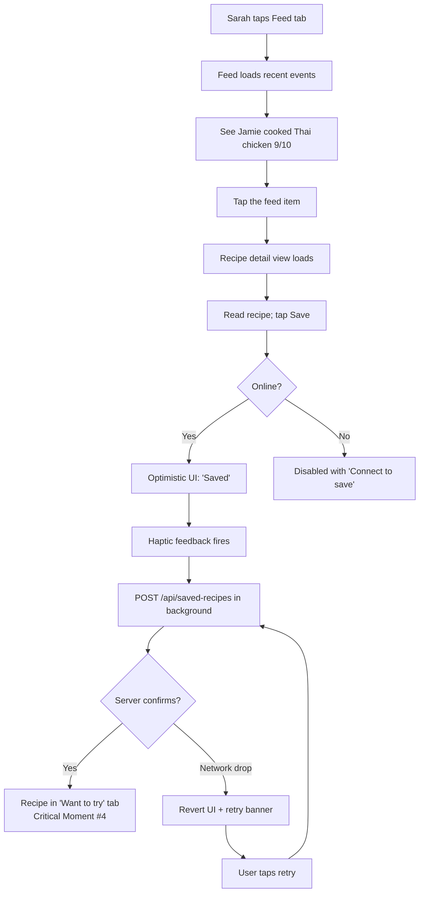
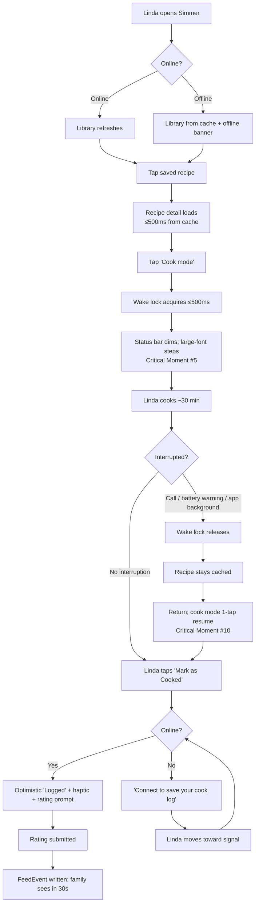

# UX Design Specification — Simmer Mobile App

**Author:** Jamesfrauen
**Date:** 2026-05-10

## Executive Summary

### Project Vision

The mobile app's UX goal is to make Simmer a **kitchen-context home-screen presence** — an icon next to Messages and Instagram that opens to a shared recipe library and a feed of what trusted family members are actually cooking. The mobile UX inherits the existing mobile-aware web UI (bottom-tab navigation at the `sm:` breakpoint, mobile-first layout, cook mode with Screen Wake Lock) and adds native-feeling layers (splash, haptics, offline-aware states, status-bar styling, edge-to-edge safe-area handling, swipe-back gesture) without redesigning core flows.

### Target Users

| Persona | Context | UX implication |
|---|---|---|
| **Jamie** (Founder, Migrating User) | Daily web Simmer user. Pain: typing URL is friction in kitchen moments. | Persistent session via iOS Keychain; library cold-start with partner-vault merge; home-screen icon competes with Instagram for the kitchen-launcher slot. |
| **Sarah** (New Family Member via TestFlight) | Late-20s, skeptical of "another web app." | TestFlight install → onboarding modal → friend search → first save-from-feed in < 5 minutes. Each step must feel like one obvious next action. |
| **Linda** (Mom, Feed Lurker + Kitchen Cook) | 60s, low tech-savvy, cooks at weak-wifi stove. | Offline cache with clear "showing cached" banner; wake-lock cook mode; large-font step display; haptic-confirmed cook log. |
| **Alex** (Partner, Push Recipient) | Browses rarely, opens app on prompt. | v2 scope, but v1 UX must remain push-deep-link-aware (no architectural blocker). |

### Key Design Challenges

1. **The "doesn't feel like a web app" gate.** App Store Review Guideline 4.2 plus user perception. The Capacitor WKWebView inherits the web UI verbatim — but iOS users expect native feels (splash, haptics, swipe-back gesture, safe areas, status bar styling, edge-to-edge layout). Polish has to add these on top of the existing web UI without disrupting flows that already work.
2. **Offline state UX without inducing anxiety.** Banner must be visible but non-intrusive. Write actions must be disabled clearly without making the user feel the app is broken. Cache freshness must be communicated ("Updated *N* min ago") so stale data isn't trusted as live.
3. **Kitchen-context UX.** Cook mode needs to work with sticky hands, low light, and weak wifi. Large tap targets, wake lock, status-bar dimming, offline-resilient rendering. This is the killer-use-case flow mobile must win.
4. **Onboarding with minimal friction.** Family members aren't power users (especially Linda). First-launch flow: install → splash → login *or* signup → onboarding modal → library *or* friend search. Each step needs one obvious next action with no dead ends.
5. **Inheriting vs. overriding the web UI.** The web is already mobile-aware. Don't redesign; add native polish on top. This shapes every UX decision — if a pattern exists on web, mobile inherits unless there's a documented native reason to override.

### Design Opportunities

1. **Native haptics as a delight surface.** Cook log, save-from-feed, partner unlink — small physical confirmations that web cannot deliver. Low engineering cost, high "this feels real" payoff.
2. **Offline-aware "calm" UX.** Most apps treat offline as an error state. Simmer treats it as a designed mode — "showing cached recipes" banner is informational, not a warning. This earns trust in Linda's kitchen.
3. **Cook mode as a flagship experience.** No competing recipe app has nailed cook-mode UX. Large-font step display, wake lock, status-bar dimming, eventually hands-free progression (v3+ voice). v1 establishes the visual language for cook mode as a first-class surface, not a toggled-on view.
4. **TestFlight onboarding as a trust artifact.** "Search Simmer in the App Store" lowers the social cost of asking your mom to join. The first-launch modal can lean into this — "your family's cookbook now lives on your home screen" — making the install moment feel like joining a private thing, not signing up for software.
5. **Free design system inheritance.** Tailwind palette (accent-amber, foreground-muted, background-elevated), Playfair Display + Geist font stack — these become the mobile design system for free. Mobile augments with iOS-native typography accents and safe-area-aware spacing, not a redesign.

### Design Constraints

- **No net new functionality.** The mobile UX delivers only what the mobile PRD's 47 FRs define. No new screens, no new flows, no new feature surfaces beyond inherited web functionality plus the explicit mobile additions already in scope (offline cache states, native polish, haptics, splash, swipe-back, safe areas, "updated *N* min ago" timestamp).
- **Mobile best practices applied to inherited flows, not via redesign.** When a web flow is awkward on mobile, the design pattern is to layer iOS-idiomatic polish — haptics, transitions, safe-area-aware spacing, native gestures, status-bar coordination — *on top* of the existing flow. Don't rebuild with a different information architecture.
- **iOS HIG compliance as the baseline.** Apple Human Interface Guidelines drive defaults for tap-target sizing, type scale, safe areas, standard gestures, status-bar styling. Where HIG and the existing web pattern diverge, reconcile by keeping the web flow's logic and adopting HIG visual conventions for the surface.

## Core User Experience

### Defining Experience

The core user experience is **the kitchen-context recipe loop**: open the app on your phone, find a recipe (your own, your partner's, friend-cooked), see what your trusted circle thinks of it, cook it, log it. This loop is **read-dominant during cooking** (recipe view, step navigation) and **write-light** (cook log with rating).

**The single most-important action is viewing a recipe at the stove** — fast load (from cache when offline), readable while hands are busy, with cook mode keeping the screen alive. Everything else (library browsing, feed scrolling, friend management, recipe creation) supports this central action.

Second-tier frequent actions, in rough order of frequency:
1. Browsing the library to decide what to cook
2. Scanning the feed for friend activity
3. Logging a cook with a rating
4. Saving a recipe from the feed

**Information Architecture commitment:** The IA inherits the web's bottom-tab navigation verbatim — **Library, Feed, Friends** (with Partner management nested inside the Friends tab, not promoted to its own tab) — and no further tab-level reorganization happens in v1.

### Platform Strategy

- **iOS-only for v1** (Capacitor wrap of Next.js app via WKWebView)
- Phone form factor primary; iPad rendering inherited from web responsive layout but not specifically optimized in v1
- Touch-only interaction — no keyboard, mouse, or Apple Pencil paths
- iOS 16+ minimum (aligns with Capacitor 7 baseline)
- TestFlight distribution to founder's family cohort; public App Store deferred to v2
- Offline-capable for reading (TanStack Query cache); online required for writes in v1

### Effortless Interactions

Per the design constraints, "effortless" comes from removing friction on existing flows — not from adding new features:

1. **Session persistence.** Sign in once on first install; stay signed in via 30-day sliding-window token in iOS Keychain. The home-screen tap path never hits a login screen for an active user.
2. **Library cold-start.** Opening the app → library renders within 2.5 s with partner's recipes already merged in.
3. **Recipe view at the stove.** Offline cache means previously-viewed recipes load in < 500 ms with no network round-trip.
4. **Cook mode enter/exit.** Single tap toggle; wake lock acquires within 500 ms; status bar dims to match the cook-mode theme.
5. **Save-from-feed.** Single tap, haptic-confirmed; no confirmation modal, no extra screen.
6. **App-resume freshness.** Bringing the app back from the home screen triggers a silent cache refresh; user sees fresh data without pulling to refresh.

### Critical Moments

The moments — both success and failure — that disproportionately shape user perception. Each must be explicitly designed, not left to framework defaults.

**Success path:**

1. **First launch after install.** TestFlight install → tap icon → native splash → login screen renders cleanly. If this feels janky, the "doesn't feel like a real app" perception locks in immediately and is hard to recover.
2. **First library load with partner-vault merge.** Jamie sees their 60 recipes plus Alex's, unified in one library. The "this is *our* cookbook" moment.
3. **First recipe view from offline cache.** Linda opens a saved recipe at the stove with weak wifi; it loads in < 500 ms with an unobtrusive "showing cached recipes" banner. Trust earned.
4. **First save-from-feed.** Sarah sees Jamie's cook in the feed, taps through to the recipe, hits save, feels the haptic confirm. The discovery → vault loop becomes muscle memory.
5. **First cook mode session.** Jamie cooks Thai basil chicken; the screen stays alive for 30 minutes, the status bar is dimmed, the steps are readable from arm's length. The flagship moment that differentiates mobile from web.

**Failure path (also designed, not left to defaults):**

6. **First-launch offline.** TestFlight install in a dead zone or weak-wifi kitchen. The app opens with no cached data and no API connectivity. Login screen presents a clear "Connect to sign in" state with a retry affordance — designed, not a framework error.
7. **Authentication failure.** Linda mis-types her password, or signup network times out. Inline error explains the next action ("Try again" or "Check your connection"), not the system failure ("Error 401: Unauthorized").
8. **Recipe extraction fallback.** Sarah pastes a URL during onboarding; Gemini returns nothing usable. The transition to manual entry is guided ("We couldn't extract this one — want to add it by hand?"), not dropped on the user as a blank form.
9. **Partner invite declined.** Jamie sends Alex an invite; Alex declines. Jamie's view updates with neutral, non-blaming language ("Alex isn't ready to link vaults yet — you can send again later"). No exclamation marks, no error styling.
10. **Cook mode interrupted.** Phone call, low-battery warning, push notification (in v2), or app backgrounding. Wake lock drops gracefully; recipe stays cached and readable on return; cook mode can be re-entered with a single tap from where the user left off.

### Experience Principles

These guide every subsequent design decision in this spec. Numbered for reference, not priority — all are binding.

- **P1 — Inherit web flows; native-polish the surface.** Don't redesign what works on web. Add iOS-feel layers on top: haptics, safe areas, swipe-back, splash, status-bar styling, edge-to-edge layout. The web flow's logic stays; the iOS surface convention adopts.
- **P2 — Offline is a designed state, not an error.** Banners are informational, not alarming. Disabled writes are clearly explained ("Connect to save"). Stale data is timestamped ("Updated 4 min ago"), not hidden.
- **P3 — When UX decisions trade off between general use and kitchen use, kitchen wins.** Sticky-fingered, low-light, weak-wifi moments are the killer use case. If a design works at the stove, it works everywhere; the reverse is not always true.
- **P4 — One obvious next action per screen.** Especially during first-launch and onboarding. No dead ends, no decision paralysis. Linda is the proof user — if she can find the next thing to tap, anyone can.
- **P5 — Perceived latency over real latency.** Optimistic UI on user-initiated writes; progress states for any operation > 300 ms; common online paths render initial state within 1 s. Where the network can't deliver, the UI says so within 300 ms.
- **P6 — Feedback (haptic, motion, audio) confirms outcomes; it does not decorate routine actions.** Use sparingly so the channels retain meaning. Cook log saved → haptic. Recipe saved from feed → haptic. Partner unlinked → haptic. Scrolling, tab-switching, ordinary taps → no feedback layer.
- **P7 — Match standard iOS gestures wherever a corresponding web pattern exists.** Swipe-back for navigation, pull-to-refresh for data lists, edge-swipe for tab switching. No invented gestures in v1; no custom gesture vocabulary.
- **P8 — Touch-first UX implies VoiceOver-first.** Every interactive element exposes a meaningful label and is reachable in logical reading order; every common task (browse library, view recipe, log a cook, save from feed) completes via VoiceOver alone.
- **P9 — Errors explain the user's next action, not the system's failure.** No status codes, no jargon, no dead ends. "Can't reach Simmer right now — try again in a moment" not "Network error 500."

**Meta-rule — Principle Conflict Resolution:**

When an inherited web flow violates other principles (especially **P4** "one obvious next action" or **P5** "perceived latency"), the **web flow stays in v1** but the conflict is recorded in `docs/mobile-polish-backlog.md` for v2 mobile-specific iteration. Don't redesign in v1; don't pretend the conflict doesn't exist. This makes the inherit-flows constraint honest about its trade-offs.

## Desired Emotional Response

### Primary Emotional Goals

| Feeling | Why it matters for Simmer |
|---|---|
| **Belonging** | "This is *our* family's cookbook." The shared partner vault, the feed of trusted people, the private friend graph. Not "another app I have to use" but "a place where my people are." |
| **Confidence** | The app works when you need it — especially at the stove with weak wifi. You don't fight it during the moment that matters most. |
| **Calm** | A thoughtful counterweight to recipe chaos (scattered Instagram saves, group-text links lost in scroll). The app is restful, not demanding. |
| **Quiet delight** | Small native confirmations — a haptic on cook log save, a wake lock that just works, a status bar that fades into cook mode. The app fits in your hand and your life without performing for you. |

### Emotional Journey Mapping

| Stage | Desired feeling | Design lever |
|---|---|---|
| **Discovery** (TestFlight install) | Curiosity → ownership | Native icon, clean splash, fast first-launch — converts "trying an app" to "having this app" |
| **First library load** | Recognition + pleasant surprise | Partner vault merged → "these are *our* recipes," not "your recipes + someone else's" |
| **First friend / partner connection** | Belonging, warmth | Real names + faces; no follower counts; no engagement nudges |
| **First save-from-feed** | Discovery delight | Haptic-confirmed; loop closes in < 5 seconds |
| **First cook mode session** | Groundedness + focus | Status bar dims, screen stays alive, large step typography — the app gets out of the way |
| **Returning use** | Anticipation, comfort | Home-screen icon next to Instagram; opening it feels like opening a small private place |
| **When something fails** | Trust preserved | Errors explain the user's next action (P9), not the system's failure |

### Micro-Emotions

Calibrated states to design for / against:

- **Confidence over confusion** — first-launch flow, one-obvious-next-action (P4), error states (P9)
- **Trust over skepticism** — offline rendered calmly (P2), data freshness timestamped, no surprise prompts
- **Quiet satisfaction over exhibitionist delight** — haptics confirm but don't celebrate; no confetti, no "achievement unlocked," no streaks
- **Belonging over isolation** — feed shows mutual friends only (no strangers); partner vault is *one shared object*, not "your stuff + their stuff merged"
- **Focus over distraction** — cook mode dims status bar, removes nav chrome, keeps screen alive; no notifications surface during it (v2 push will respect this)

### Design Implications

| Emotional goal | UX design approach |
|---|---|
| **Belonging** | Use real names in feed and partner vault — "Alex saved this," "Mom cooked this." Partner vault rendered as "ours," not "yours + theirs merged." No anonymous user IDs surfaced. |
| **Confidence** | Loading states < 300 ms; optimistic UI for writes (P5); offline cache as default render path; never a blank screen during a known-safe operation. |
| **Calm** | No badges, no streaks, no engagement nudges. Pull-to-refresh, not auto-update interruptions. Banners are informational, never alarming. |
| **Quiet delight** | Haptic feedback on outcome moments only (P6); subtle motion (200–300 ms ease curves), no celebratory animation. |
| **Focus** (cook mode) | Dimmed status bar; large step typography; minimum chrome; wake lock; no notification interruption during the session. |
| **Trust** | Error messages name the user's next action (P9); freshness timestamps on cached data (FR22); clear write-disabled states with explanation (FR24). |

### Emotions to Avoid

- **Pressure** — no streaks, no "you haven't cooked in X days," no growth-loop nudges
- **FOMO** — feed is not algorithmic; no "trending"; no popularity counts
- **Performance anxiety** — no public profiles, no follower counts, no leaderboards, no comparisons
- **Confusion** — Linda is the proof user; if she feels stupid, the design failed
- **Technical alienation** — no error codes, no jargon, no "please contact support" dead ends

### Emotional Design Principles

These augment (do not replace) the 9 Experience Principles from Step 3:

- **E1 — Belonging over engagement.** Design for the feeling of being in a private place with your people, not the pressure of contributing to a public platform.
- **E2 — Calm by default.** Notifications, badges, and animations are rare and meaningful. Quiet UX builds trust over time.
- **E3 — Confidence is built through reliability, not enthusiasm.** No exclamation marks. No "amazing!" or "great job!" — just clear outcomes and meaningful feedback.
- **E4 — Names over numbers.** Show "Alex," "Mom," "Sarah" — not user IDs, not counts. The social graph is small and intimate by design.
- **E5 — Quiet delight through native moments.** A haptic tap, a wake-lock that holds, a status bar that fades — these are the delight surface. No confetti. No "achievement unlocked."

## UX Pattern Analysis & Inspiration

### Inspiring Products Analysis

| App | Why it's relevant | What we learn |
|---|---|---|
| **iOS Messages** | The gold standard for "belonging in a private inner circle." Everyone in the family already uses it daily. | Real names + faces as identity (E4); haptic-confirmed sends (P6); native iOS swipe-back gestures (P7); zero public discovery; conversation-as-primary surface; no algorithm. |
| **Apple Notes** | Calm utility done right. No engagement pressure, no streaks, no notifications. | Calm-by-default aesthetic (E2); fast offline reads; instant search; no decorative chrome; nothing demands attention; users return because it's reliable, not because it nags. |
| **Letterboxd** | Friend-graph-as-discovery for a single activity. Private-feeling social with ratings. | Trusted-circle activity feed (already in PRD); rating visibility on cards; review-style social commentary; small inner-circle aesthetic. **Caveat:** Letterboxd allows public profiles — Simmer adapts the *spirit* of friend-graph discovery, not the openness. |
| **Paprika / Pestle / Mela** | Native recipe apps with mature cook-mode UX. Direct competitors but isolation-first (no social). | Offline-first recipe reading; cook mode with persistent screen; clean step navigation; ingredient lists at-a-glance. Simmer adopts these patterns and adds the missing social layer. |
| **AllTrails** | Offline-cached essential content for low-connectivity contexts (the trail = the kitchen analog). | Explicit "offline / cached" indicator; trustworthy in dead zones; offline framed as designed mode, not error (E2 / P2). |
| **Instagram Saves** *(the mental model only)* | The "one-tap save to a collection" pattern is muscle memory for Sarah and Alex. | Single-tap save with haptic confirm; no confirmation modal; saved item appears in a personal collection. **Caveat:** Simmer adopts the save mechanic, NOT the algorithmic feed or follower counts. |

### Transferable UX Patterns

**Navigation patterns** (from iOS Messages, Notes, Letterboxd):
- Bottom-tab navigation (already inherited from web — Library / Feed / Friends)
- iOS swipe-back gesture on nested screens (P7, FR40)
- Pull-to-refresh on feeds and lists (FR38)
- Tab bar respects safe-area home indicator (FR46)

**Interaction patterns** (from Messages, Paprika, Instagram Saves):
- Haptic-confirmed outcome actions — cook log, save-from-feed, partner unlink (P6, FR28–FR30)
- One-tap save to "want to try" with haptic confirm — no confirmation modal (Effortless Interaction #5)
- Cook mode as the primary action on recipe detail — Paprika-style (FR25)
- Standard iOS long-press for secondary contextual actions where they exist on web (P7)

**Visual patterns** (from Notes, Letterboxd, Pestle):
- Generous whitespace and calm typography — inherited from web (Playfair Display + Geist)
- Real names + small avatars in social contexts — Letterboxd-style identity
- Subtle accent-amber color used sparingly — Pestle's restrained palette ethos
- Status bar adapts to context — dimmed during cook mode (FR27), neutral elsewhere

**Information Architecture patterns:**
- Activity feed = chronological, not algorithmic — Letterboxd, not Instagram
- Recipe library = sortable + filterable + searchable — Paprika
- Profile screen absent or minimal — Notes / Messages model (Simmer has no profile feed)

### Anti-Patterns to Avoid

**From the recipe-app category:**
- Yummly-style "meal planning + grocery list + nutrition tracking" feature bloat — Simmer is intentionally narrow (no new features in v1)
- Cookpad public-recipe browsing — Simmer is private-circle only
- Pepper's "follow strangers" social model — Simmer is mutual-friend only

**From the social-app category:**
- Instagram's algorithmic feed — chronological-only
- Strava-style streaks and weekly badges — no engagement nudges (Emotions to Avoid)
- TikTok / Snapchat daily-streak pressure — no obligation to open
- Public follower counts and like-counts — no performance comparisons (E1)
- Performative "achievement unlocked" celebration animations — no confetti (E3)

**From mobile UX in general:**
- "Skip onboarding" buttons that hide critical setup — Simmer's onboarding is short enough to never need a skip
- Modal-heavy interrupts for state changes — use inline states (banners, timestamps, disabled controls)
- Auto-playing video / animation — no
- Status-code-style error messages — P9 covers this
- Dark patterns obstructing unsubscribe/delete/unlink — partner unlink is one tap with haptic confirm
- Push permission prompt on first launch — deferred to first feed view in v2 (already in PRD)

### Design Inspiration Strategy

**What to adopt:**
- **Messages-style** haptic confirmation on outcome actions and native iOS gestures
- **Notes-style** calm, decoration-free utility aesthetic — no demand for attention
- **Letterboxd-style** friend-graph-as-discovery with real names + ratings visible on cards
- **Paprika-style** cook-mode reading UX — large fonts, wake lock, minimum chrome
- **AllTrails-style** offline-state design as calm informational mode

**What to adapt:**
- Instagram's *save-to-collection mental model* (single tap, haptic confirm) — but never the algorithmic feed, follower counts, or public discovery
- Letterboxd's *rating visibility on cards* — but Simmer's ratings are visible only within the trusted circle, not public

**What to avoid:**
- Engagement-loop patterns (streaks, badges, daily-use nudges, "you haven't logged a cook in X days")
- Public-social patterns (profiles, followers, discovery, leaderboards)
- Algorithmic feed ordering
- Feature creep beyond the kitchen-context loop (meal planning, grocery lists, nutrition tracking — all v3+ vision, not v1)
- Modal-heavy onboarding
- Status-code error language

## Design System Foundation

### Design System Choice

**Inherit the existing web Tailwind CSS v4 design system, augmented with iOS-platform tokens.**

This is not a fresh design-system selection — the design constraint ("no new visual identity, inherit web flows") predetermines the answer. The web app already defines:

| Layer | Existing web foundation |
|---|---|
| **Color palette** | Custom Tailwind palette: `accent-amber`, `foreground`, `foreground-muted`, `background`, `background-elevated`, and others defined in `src/app/globals.css` |
| **Typography** | Playfair Display (display / headings) + Geist sans (body) + Geist mono (code / data) — loaded via `next/font/google` |
| **Spacing** | Tailwind's default scale + safe-area-aware insets via `env(safe-area-inset-*)` |
| **Component library** | Ad-hoc Tailwind utility composition (no shadcn, MUI, Chakra). Per `docs/component-inventory.md`: "common patterns are duplicated rather than extracted" |
| **Brand** | Accent-amber as the primary action color; muted neutrals; restrained palette consistent with the calm / Notes-style aesthetic identified in Step 5 |

**Tier:** Themeable system (Tailwind utility palette with custom design tokens) — the middle tier of the three options the workflow presents (Custom / Established / Themeable). Tailwind sits cleanly in the themeable tier.

### Rationale for Selection

1. **The design constraint demands it.** "No new visual identity" rules out custom-from-scratch or migration to an established system (Material, HIG-native).
2. **Capacitor WKWebView inherits CSS automatically.** No porting effort — same Tailwind classes render on iOS as in Safari.
3. **The web design is already mobile-aware.** Bottom-tab nav, mobile-first responsive layout, restrained color palette — these were originally designed with mobile in mind. Inheritance is the natural shape, not a compromise.
4. **Solo-dev feasibility.** Maintaining one design system (web Tailwind) is half the work of maintaining two. Aligns with the PRD's "packaging shift, not rewrite" framing.

### Implementation Approach

- **Source of truth:** `src/app/globals.css` for design tokens (already exists for web; no new file in v1).
- **No new design tokens** are introduced in v1. Augmentation is deferred until a specific iOS need surfaces during real-device QA (NFR41).
- **Native iOS visual assets** (splash screen, app icon, status bar styling) are produced *outside* Tailwind:
  - **Splash:** native `LaunchScreen.storyboard` via `@capacitor/splash-screen` — references existing accent-amber and background-elevated values manually
  - **App icon:** native asset set (all iOS sizes per FR10) using the existing brand mark; uses iOS adaptive layers
  - **Status bar:** `@capacitor/status-bar` plugin reads existing CSS-variable color values to set bar style based on cook-mode state (FR27)
- **Component library posture:** continue the "ad-hoc Tailwind utility composition" pattern. Do NOT introduce shadcn / MUI / Headless UI in v1. Consolidation is a future refactor, not a mobile-launch task.

### Customization Strategy

Per the **Mobile Polish Backlog meta-rule** (Step 3), any visual gap surfaced during mobile testing is captured but not addressed in v1.

**Mobile augmentations already in scope** (no new design tokens needed; iOS provides the values):

- **Safe-area-aware spacing** — root layout uses `env(safe-area-inset-top/bottom/left/right)` CSS variables. No new Tailwind token; CSS env-vars suffice. (FR46)
- **Status bar styling** — Capacitor plugin sets `style: "dark"` / `"light"` based on cook-mode state, referencing existing palette colors. (FR27)
- **Splash screen** — native asset referencing existing accent-amber on background-elevated.
- **App icon** — native asset set (1024×1024 base, plus all iOS sizes per FR10).
- **Cook-mode "large step typography"** — uses existing Tailwind size scale (`text-2xl` / `text-3xl` for steps). No new tokens.

**Deferred to `docs/mobile-polish-backlog.md`** (per meta-rule; addressed in v2 only if needed):

- Formalized iOS design-token file (e.g., `src/styles/ios-tokens.css`) — only if v2 reveals real divergence pressure
- iOS-native typography fallback (SF Pro) — only if Geist rendering shows issues on iOS
- Haptic-feedback "vocabulary" formalization — currently 3 haptic moments (FR28–FR30) accessed via Capacitor plugin directly; codify into a `useHapticFeedback()` hook if v2 adds more triggers
- Component library extraction (the `docs/component-inventory.md` "duplicated patterns" cleanup) — orthogonal to mobile launch; not blocking

## Defining Interaction — Cook Mode at the Stove

### Defining Experience

The defining mobile experience is **"view a recipe at the stove in cook mode."** This single interaction:

- **Differentiates mobile from web.** Web has cook mode too, but the experience is degraded by kitchen-wifi flakiness, a screen that sleeps, and browser chrome competing for real estate.
- **Aligns with the killer use case** (kitchen context, P3).
- **Justifies every mobile-specific v1 investment** — offline cache (FR19, FR20), wake lock (FR26), status bar dimming (FR27), haptic confirm on cook log (FR28).
- **Is the flagship "this is why we built a mobile app" moment** for Jamie and Linda.

If we nail this, every other interaction inherits credibility. If we fail this, the app fails — no recovery, because the moment that matters most has been blown.

### User Mental Model

**How users currently solve this (pre-Simmer / web):** Recipe in a browser tab or screenshot; phone goes to sleep; sticky hands try to poke it awake; wifi flakes and they lose their place. The web app cook mode works, but typing a URL with garlic hands is friction. A browser tab disappears when they switch to Messages to text their partner.

**How users want this to work (inherited from iOS Messages / Paprika mental models):**
- Tap an icon on the home screen — the app is *right there*
- The recipe loads instantly (because it's cached)
- The step list is *big* and readable from arm's length
- The screen *stays on* (because of course it does — it's cook mode)
- When done, *one tap* logs the cook
- A haptic confirms — the phone vibrates as the rice cooker finishes

**Where they get confused / frustrated, and how Simmer answers it:**

| Friction | Mitigation |
|---|---|
| "Is the app frozen or is wifi out?" | Offline state banner (P2, FR21) |
| "Is this recipe up to date?" | "Updated *N* min ago" timestamp (FR22) |
| "How do I exit cook mode?" | Single-tap exit; primary button persists on detail view |
| "Did my cook log save?" | Haptic confirm on success (P6, FR28) + optimistic UI (P5) |

### Success Criteria

The defining interaction succeeds when:

- **Latency:** Recipe loads in ≤ 500 ms from cache (NFR2).
- **Persistence:** Screen stays alive for the full cooking session (NFR5 wake lock acquire ≤ 500 ms; persists until user exits cook mode or backgrounds the app).
- **Readability:** Text is legible from arm's length without the user bending over the phone (cook-mode large typography uses existing Tailwind scale, no new tokens).
- **Resilience:** Network drops don't disrupt the read experience (offline cache, FR20).
- **Completion:** Cook log + rating completes in ≤ 2 taps with haptic confirmation (FR28).
- **Recovery:** Phone-call / push (v2) / battery-warning interrupts release wake lock cleanly; user returns to find cook mode resumable in one tap (Critical Moment #10).

**The narrative success state:** *Jamie cooks Thai basil chicken for 30 minutes and never thinks about the app during the process.* That's the win.

### Novel vs. Established Patterns

**This is an ESTABLISHED pattern.** Paprika, Pestle, Mela, and BigOven all implement a cook mode with screen-on + step navigation. Simmer's cook mode (already shipped on web) inherits the established pattern verbatim.

**Simmer's twist is *composition*, not invention:**

- Cook mode + offline cache for weak-wifi kitchens (AllTrails-style offline as designed state)
- Cook mode + haptic-confirmed cook log on completion (Messages-style outcome feedback)
- Cook mode + dimmed status bar for reduced visual noise (FR27)
- Cook mode + rating that feeds the social loop (sister sees the 9/10 in her feed within 30 seconds)

**None of these are net new functionality.** Every element is present in the PRD's FRs. The defining experience is the composition of established patterns under a single coherent moment — not the invention of a new pattern.

### Experience Mechanics

**1. Initiation**

- **Trigger:** Tap the "Cook mode" primary action button on the recipe detail view (single primary action — no competing CTAs).
- **Pre-condition:** Recipe detail rendered (fresh-online or from cache per FR20).
- **System response (within 500 ms):** status bar dims to match cook-mode theme (FR27); wake lock acquires (FR26); step display switches to large-font mode.
- **User signal:** subtle status bar transition is the only visual cue needed — no animation, no celebration (E5).

**2. Interaction**

- **User actions:** reads the current step; scrolls or swipes to advance (inheriting web's existing pattern; standard iOS gestures per P7); glances at the ingredient list collapsed below the steps.
- **System actions:** holds wake lock; renders from cached recipe; status bar stays dimmed; no notifications interrupt (v1 has no push; v2 push will respect cook mode).
- **No haptics during reading** — per P6, haptics confirm outcomes, not navigation. Scrolling is silent.

**3. Feedback**

- **Success signal:** screen stays alive; no loading spinners; steps don't reflow or disappear; the offline banner (if shown) doesn't intrude.
- **Mistake recovery:** if the user accidentally taps something that exits cook mode, re-entry is one tap (the primary button is preserved on the detail view).
- **Interruption recovery (Critical Moment #10):** phone call / battery warning / app backgrounding releases the wake lock; on return, the recipe is still rendered from cache; cook mode can be re-entered with one tap; step position is preserved via scroll position.

**4. Completion**

- **User signal:** taps "Mark as cooked" (from cook mode view OR via the primary cook button on recipe detail after exit).
- **System response:** optimistic UI shows cook logged (P5); haptic feedback fires (FR28); rating dialog appears for the rating step (existing web flow inherited).
- **After rating:** cook event written to `FeedEvent` (existing web behavior); the feed updates within 30 s polling (existing FR6); connected friends see the cook in their feed within ~1 minute.
- **Final state:** user exits cook mode or backgrounds the app; screen returns to normal brightness; status bar resumes default style.

**Mental model affirmed:** *"I opened the app. I cooked. I tapped done. My family saw it. The app got out of my way for 30 minutes."* That is the defining interaction in one sentence.

## Visual Design Foundation

### Color System

The mobile app inherits the web's Tailwind CSS v4 palette in full. The semantic mapping below clarifies *role*, not pixel values — actual color values live in `src/app/globals.css` and are the source of truth.

| Role | Token (web inherited) | When used |
|---|---|---|
| **Primary action** | `accent-amber` (and shades) | Cook log button, save button, primary CTAs, active tab indicator |
| **Foreground (primary text)** | `foreground` | Body text, recipe titles, screen headlines |
| **Foreground (secondary text)** | `foreground-muted` | Timestamps, secondary metadata, captions, attribution |
| **Background (canvas)** | `background` | Page background |
| **Background (elevated surfaces)** | `background-elevated` | Recipe cards, modal sheets, banners, the "you're offline" indicator |
| **Border / divider** | existing Tailwind border tokens | Recipe card borders, separator lines |
| **Destructive** | existing semantic token (likely red-based) | Partner-unlink confirmation, recipe delete |
| **Info / offline banner** | `background-elevated` + muted text | Offline state banner — never alarmist styling |

**Mobile-specific layer** (no new tokens — composes existing values):

- iOS safe-area insets via `env(safe-area-inset-*)` CSS variables, applied at the root layout level
- Cook-mode status bar styling: `@capacitor/status-bar` plugin reads existing background values to set bar style (FR27)
- Splash background: native asset built using existing `background-elevated` color (specified at native-asset build time, not at runtime)

### Typography System

The mobile app inherits the web's font stack verbatim:

| Family | Use | Notes |
|---|---|---|
| **Playfair Display** | Display / headings (recipe titles, screen titles) | Serif accent — gives the app a warm cookbook feel; aligns with the calm / Notes-style aesthetic |
| **Geist Sans** | Body text, UI labels, button labels | Modern sans-serif; loaded via `next/font/google` |
| **Geist Mono** | Time durations, ratings, code-like data | E.g. "9/10", "25 min", "Updated 4m ago" |

**Type scale** — inherited Tailwind default scale:

| Tier | Tailwind class | Used for |
|---|---|---|
| Cook-mode steps | `text-2xl` to `text-3xl` | Large, readable from arm's length |
| Recipe titles, screen titles | `text-xl` to `text-2xl` | Primary content headlines |
| Recipe titles in cards | `text-lg` | Library / feed cards |
| Body content | `text-base` | Ingredients, steps in normal view, feed body |
| Metadata | `text-sm` | Timestamps, attribution, tag labels |
| Tertiary labels | `text-xs` | Very secondary annotations |

**iOS-specific considerations:**

- **Dynamic Type support** (NFR27) — text scales with iOS system text-size setting up to the next Tailwind breakpoint
- **No SF Pro substitution.** Geist matches the web identity; native iOS feel comes from gestures, haptics, splash, and status-bar styling — not typography
- **Mobile-polish-backlog item:** if Geist rendering shows quality issues on iOS during real-device QA, evaluate an SF Pro fallback (per Step 3 meta-rule)

### Spacing & Layout Foundation

**Spacing scale:** Tailwind default (4 px base unit; 0.5 / 1 / 1.5 / 2 / 2.5 / 3 / 4 / 5 / 6 / 8 / 10 / 12 increments).

**Layout density:** Airy, generous whitespace — aligns with the calm aesthetic (E2). Recipe cards have visible breathing room; lists are not dense.

**Grid system:** Single-column on phone. The web's existing responsive grid kicks in only on tablet/desktop rendering (iPad inherited but not specifically optimized in v1).

**Layout principles (mobile-specific):**

1. **Safe-area-aware layout** — top content respects `env(safe-area-inset-top)` (notch / Dynamic Island); bottom tab bar respects `env(safe-area-inset-bottom)` (home indicator). FR46.
2. **Edge-to-edge content** — recipe imagery and feed cards extend to screen edges where appropriate; content padding respects safe areas.
3. **Touch-target minimum** — 44 × 44 points for all interactive elements (NFR28). Tap-target zone may exceed visible bounds where the visual element is intentionally small (e.g. icon-only buttons).
4. **Bottom-tab nav** — inherited from web `NavBar` at the `sm:` breakpoint; always anchored to screen bottom above the home indicator.
5. **Modal sheets** — where the inherited web app uses modal overlays, render as iOS-native modal sheets (slide up from bottom, swipe down to dismiss). Non-modal patterns (inline edit, expand-in-place) preferred where they already exist on web.

### Accessibility Considerations

Aligned with NFR26–NFR29 plus design Principle P8 (VoiceOver-first):

- **VoiceOver** — every interactive element exposes a meaningful label; the four common tasks (library browse, recipe view, log cook, save from feed) complete via VoiceOver alone (P8, NFR26)
- **Dynamic Type** — text scales with iOS system size; layouts reflow without truncation up to large accessibility text sizes (NFR27)
- **Touch targets** — 44 × 44 pt minimum (NFR28)
- **Contrast** — WCAG AA: 4.5:1 normal text, 3:1 large text (NFR29)
- **Dark mode** — reactive to iOS system setting (FR47). *Assumed* the web Tailwind palette has dark-mode variants defined; if real-device QA reveals gaps, add to mobile-polish-backlog
- **Reduced motion** — respect `prefers-reduced-motion`; disable subtle animations / transitions for users with motion sensitivity. No new design tokens needed (web standard)
- **Color independence** — no information conveyed by color alone. Error states pair text + icon; offline state pairs banner + disabled controls
- **VoiceOver-tested flows in v1 cohort QA** — library browse, recipe view, log cook, save from feed, partner unlink (P8, NFR41)

**What this section deliberately does NOT cover:**

- **Animation / motion language** — addressed in Step 11 (Component Strategy) / Step 12 (UX Patterns) where transitions tie to specific components
- **Screen-by-screen mockups** — UX specs document principles + foundations; visual mockups are Figma/design-tool deliverables produced separately
- **Iconography catalog** — inherited from existing web (likely Lucide or similar); no new icons in v1

## Design Direction Decision

### Design Directions Explored

Per the design constraints established in Step 2 ("no net new functionality, no new visual identity, inherit web flows"), Step 6 (design system inheritance), and Step 8 (visual foundation locked to the web Tailwind palette), there is **no meaningful exploration space for alternative visual directions in v1**.

Any design direction that diverges from the existing web visual language would violate the inherit-web-flows constraint. The 6–8 alternative mockup approach this step normally produces would yield mockups that are all variations of the same direction — visual theater that doesn't inform a real decision.

**A single design direction is documented and locked.** Alternative exploration is deferred to v2 (where mobile-specific divergence may become justifiable based on real-device usage data and family-cohort feedback).

### Chosen Direction

**Direction: "Web inheritance + iOS polish."**

Visual character:
- Cookbook-warm Playfair Display headings paired with Geist sans body
- Calm accent-amber primary action color used sparingly
- Generous whitespace; airy density; restrained motion (E2 calm-by-default)
- iOS-native chrome layered on inherited content (status bar styling, splash, safe areas, swipe-back, haptics)

This direction is the **same visual language as the deployed web app**, modulated by Capacitor's native shell. Family members who have used web Simmer will recognize the design immediately — that's intentional. The mobile app is the same brand in a different package, not a redesign.

### Design Rationale

1. **The design constraint demands it.** No new visual identity rules out direction variation.
2. **Recognition for migrating users (Jamie).** The "this is the app I already know, in a better wrapper" feeling is the goal — visual continuity earns this.
3. **Solo-dev feasibility.** Maintaining one visual system is half the work of two.
4. **Family validation, not design experimentation, is v1's goal.** Per the MVP strategy in the PRD, v1 is a platform MVP. Designing alternative visual directions would burn time that should go toward shipping.

### Implementation Approach

- **Source of truth:** the existing web app at `simmer.vercel.app` defines the visual reality. Capacitor renders this verbatim.
- **No HTML mockup variants** produced for v1. If a mobile-polish-backlog item surfaces an alternative direction (e.g. dark-mode contrast issues, status-bar style mismatch), it is addressed surgically — not via an alternative-direction exploration.
- **Real-device QA on the founder's iPhone** (NFR41) replaces the "mockup comparison" function this step normally serves. The founder's iPhone *is* the mockup.
- **Mobile-polish-backlog** (`docs/mobile-polish-backlog.md`) captures any divergence pressure observed during real-device QA for v2 consideration.

### Skipped Artifact Acknowledgement

This step normally produces a `ux-design-directions.html` artifact with 6–8 interactive mockup variations. **That artifact is explicitly not produced for v1** because:

1. The constraints predetermine the direction
2. The web app itself is the design reference
3. Real-device QA replaces mockup-based decision-making
4. Solo-dev time is better spent shipping than on alternative-visual exploration

If v2 demands a meaningful redesign of a specific surface (e.g. cook-mode large-typography variant exploration), a scoped HTML mockup exercise can be produced at that time.

## User Journey Flows

The PRD's 4 personas provided the narrative ("who" and "why"). This section designs the mechanics ("how" — entry, decisions, branches, recovery). Three flows cover the v1 critical paths. Journey 4 (push-notification recipient) is v2-scoped and excluded — push flow doesn't exist in v1.

### Flow A: First Install & Login — Jamie (Migrating User)

**Key mechanics:**
- Returning-session path has **zero user input** between tap and library — the home-screen tap is the entire interaction
- First-launch path requires **one screen** (login) plus one optional modal (onboarding) before library
- Authentication failures present **inline errors** at the same login screen — no modal, no navigation away from the field the user typed in
- Network errors during login route to the *same* inline message style — failure-mode parity (Critical Moments #6, #7)

### Flow B: First Save-from-Feed — Sarah (New Family Member)

**Key mechanics:**
- Save action is **3 taps total**: Feed tab → feed item → Save button
- Save completes optimistically before server confirms (P5) — perceived latency is < 100 ms even on slow networks
- Haptic feedback (FR29) fires immediately on tap, not after server confirmation — it confirms *intent*, not *outcome*
- If the server rejects (rare — partner unlinks mid-action or similar), UI reverts with a clear retry affordance — never a status code or dead end (P9)

### Flow C: Cook Mode at the Stove — Linda

**Key mechanics:**
- The "happy path" includes offline entry — opening the app on weak wifi is not a failure case, it's a designed branch (P2)
- Cook mode entry → wake lock active is **the moment of trust** for kitchen-context use; ≤ 500 ms acquire is a hard target (NFR5)
- Interruption recovery is explicitly designed (Critical Moment #10) — wake lock releases gracefully; cache survives; cook mode is one tap to re-enter
- Write actions disabled offline with the **specific reason** (the cook log itself, not generic "you're offline") — preserves trust (P9)

### Journey Patterns

Common patterns extracted across all flows. Standardized so designers and developers don't reinvent per-screen.

**Navigation patterns:**
- Bottom-tab nav persistent on Library / Feed / Friends (inherited from web `sm:` breakpoint)
- iOS swipe-back gesture from all nested screens (P7, FR40)
- Pull-to-refresh on lists (FR38); no auto-refresh interrupts the user (E2)
- Back navigation never destroys unsaved input — return to the same form state on swipe-back

**Decision patterns:**
- **Network presence** is the most frequent branch — every write decision is "Online? → optimistic / disabled with reason"
- **Session validity** branches at app launch and on any 401 response
- **First-ever-vs-returning user** branches at login success
- All decision branches have a *designed UI state* — no framework-default error paths

**Feedback patterns:**
- Optimistic UI for all user-initiated writes (P5); revert only on confirmed server failure
- Haptic feedback on outcome moments (P6): cook log saved, save-from-feed, partner unlink — three moments total
- Inline error messages over modals (E2); errors live where the user's attention already is
- Banners (not toasts) for persistent state — "you're offline," "x friend request pending"
- No celebratory animation on success (E3) — restraint preserves the meaning of the feedback channels

**Recovery patterns:**
- Auth failure → re-display the same login screen with inline error in the field the user was editing (no error modal, no navigation)
- Network drop on write → revert optimistic UI + show inline retry banner — never lose user's input
- Cook mode interrupted → wake lock releases gracefully; cache survives; one-tap re-entry to the exact step

### Flow Optimization Principles

These augment the Experience Principles from Step 3 with flow-level specifics:

1. **Minimize steps to value.** Sarah's save-from-feed is 3 taps total. Jamie's returning-session launch is 0 input (tap icon → library). Linda's recipe-from-cache view is 1 tap (library → recipe).
2. **Optimistic UI everywhere.** Writes show success immediately; only revert on confirmed failure (P5). Perceived latency dominates real latency.
3. **Inline over modal for errors.** Modals interrupt and lose context. Inline messages preserve the user's mental state (E2).
4. **Offline is a designed branch, not a fallback.** Every flow above has an explicit offline path with its own UI state; nothing is left to "framework default" error rendering.
5. **Haptic only on outcome moments.** Three haptic moments total in v1 (cook log save, save-from-feed, partner unlink). Navigation, scroll, routine taps stay silent so the haptic channel retains meaning (P6).
6. **No dead-end errors.** Every error state names the next user action (P9). "Try again," "Connect to save," "Move to signal" — never "Error 500."
7. **Recovery from interruption is one tap.** Cook-mode interruption, network drop, app backgrounding, auth failure — all return-to-task paths are one explicit, visible tap. No multi-step recovery.

## Component Strategy

### Design System Components

The mobile app inherits the **entire existing web component library** from `src/components/` via the Capacitor WKWebView wrap. No new feature components are introduced in v1.

**Inherited web components (no changes needed for mobile):**

| Component | Mobile behavior |
|---|---|
| `NavBar` | Bottom-tab nav at `sm:` already mobile-aware; renders inside safe area on iOS |
| `LogoutButton` | Triggers logout flow + Keychain + cache clear (FR17, FR33) |
| `OnboardingModal` | First-launch modal (FR36) |
| `RecipeLibrary` | Library cold-start with partner-vault merge |
| `RecipeCard` | Grid/list card; respects safe areas via parent layout |
| `SearchBar` | Full-text search over library |
| `FilterPanel` | Multi-select filter UI; renders as bottom sheet on mobile (inherited responsive pattern) |
| `RecipeDetail` | Recipe detail + cook mode (existing `useWakeLock`) |
| `RecipeForm` | Create/edit form; URL summarize integration |
| `FeedList` | Feed with 30s polling (existing `useFeedPolling`) |
| `FeedItem` | One feed event row |
| `FriendRequests` | Pending request management |
| `FriendSearch` | Email search + send request |
| `PartnerSection` | Partner invite / accept / unlink |

These components carry their existing accessibility, state management, and Tailwind styling onto mobile unchanged. No re-implementation, no porting.

### Custom Components (Mobile-Only Integration Layer)

These are **integration layers** between Capacitor plugins and the existing web UI — they fulfill v1 FRs but introduce no new feature surface. Each wraps a single concern.

#### 1. `OfflineBanner` (component)

- **Purpose:** Renders the persistent "You're offline — showing cached recipes" banner at the top of the layout when network is unavailable (FR21).
- **Anatomy:** Single horizontal bar; muted-foreground text on `background-elevated`; sits below the safe-area top inset.
- **States:** Hidden (online), visible (offline). Non-dismissible per FR39; dismisses automatically when network returns (FR37).
- **Accessibility:** VoiceOver label: "You are offline. The app is showing cached recipes." (P8, NFR26).
- **Behavior:** Subscribes to `useNetworkState()`. No-ops on web (web has its own connectivity story).

#### 2. `CacheTimestamp` (component)

- **Purpose:** Renders "Updated *N* min ago" label on recipe detail views to communicate cache freshness (FR22).
- **Anatomy:** Single text label, `text-xs foreground-muted`, positioned near the recipe title.
- **States:** Just-fetched (no label or "Updated now"), 1+ min ago, 5+ min ago, 1+ hr ago, > 24 hr ago ("Updated 2 days ago"). Same convention as Messages / Mail / Slack.
- **Accessibility:** VoiceOver reads the full label naturally.
- **Behavior:** Reads `dataUpdatedAt` from TanStack Query's cache; re-renders on cache update (FR23, FR37).

#### 3. `useHapticFeedback()` (hook)

- **Purpose:** Single integration point for `@capacitor/haptics` calls. Codifies the 3 v1 haptic moments (FR28–FR30).
- **API:** Returns three named functions: `confirmCookLog()`, `confirmSaveFromFeed()`, `confirmPartnerUnlink()`. Each maps to a specific Capacitor haptic intensity (medium-impact for outcomes).
- **States:** N/A (effect-only). No-ops on web.
- **Accessibility:** Haptic feedback is supplementary; never the only feedback channel (NFR29 color/text independence applies analogously).
- **Backlog note:** If v2 expands haptic moments beyond 3, this hook is the formalization point (per Step 6 deferred polish).

#### 4. `useStatusBarMode()` (hook)

- **Purpose:** Sets iOS status-bar style based on app context (FR27).
- **API:** `setMode('default' | 'cook-mode')`. Cook mode dims the bar; default restores it.
- **Behavior:** Wraps `@capacitor/status-bar` plugin. Called from `RecipeDetail` cook-mode toggle.

#### 5. `useAppResume()` (hook)

- **Purpose:** Listens for `@capacitor/app` `appStateChange` events and triggers `queryClient.invalidateQueries` on resume (FR23).
- **API:** No return value; effect-only when mounted at app root.
- **Behavior:** Invalidates library + feed queries on every foreground transition; recipe-detail queries respect their `Infinity` staleTime unless explicit pull-to-refresh.

#### 6. `useNetworkState()` (hook)

- **Purpose:** Single source of truth for online/offline state. Powers `OfflineBanner` and write-action gating (FR20, FR24).
- **API:** Returns `{ isOnline: boolean }`. Consumers conditionally disable writes and surface the offline reason inline.
- **Behavior:** Wraps `@capacitor/network`. On web, falls back to `navigator.onLine`.

#### 7. `SafeAreaLayout` (wrapper)

- **Purpose:** Applies iOS safe-area insets to the root layout (FR46). Bottom-tab nav above home indicator; top content below notch / Dynamic Island.
- **Anatomy:** A wrapper around the existing root layout that adds CSS env-var padding.
- **Behavior:** Uses `env(safe-area-inset-*)` CSS variables; pure CSS — no JavaScript runtime cost.

#### 8. Native-asset components (no React code)

- **iOS splash screen** — `LaunchScreen.storyboard` consumed by `@capacitor/splash-screen` (FR9). Not a React component; native asset.
- **iOS app icon set** — native asset bundle for all required iOS sizes (FR10). Not a React component.

### Component Implementation Strategy

- **Inherit before extending.** All existing web components are used unchanged. Mobile-only components are *additive integration layers*, never replacements.
- **Hooks over wrapper components for Capacitor plugins.** Capacitor APIs are imperative; React hooks are the idiomatic React boundary. Using `useHapticFeedback()` keeps Capacitor's imperative API out of JSX.
- **`Capacitor.isNativePlatform()` is the single runtime check.** Each hook / component no-ops gracefully on web. No conditional UI rendering — same React tree on both platforms.
- **No new design tokens.** All mobile components use existing Tailwind tokens (`accent-amber`, `foreground-muted`, etc.) per Step 6 + Step 8.
- **Accessibility built-in.** Every custom component has explicit VoiceOver labels (NFR26) and respects `prefers-reduced-motion`.

### Implementation Roadmap

**Phase 1 — Foundation (week 1–2):**
1. `useNetworkState()` + `OfflineBanner` (FR20, FR21, FR24) — gates every write action
2. `SafeAreaLayout` wrapper (FR46) — applied at app root
3. `LaunchScreen.storyboard` + app-icon set (FR9, FR10) — needed for any TestFlight build to install

**Phase 2 — Native polish (week 3–4):**

4. `useHapticFeedback()` + integration into existing `RecipeDetail` and `FeedItem` (FR28, FR29, FR30)
5. `useStatusBarMode()` + cook-mode integration in `RecipeDetail` (FR27)

**Phase 3 — Cache UX (week 4–5):**

6. `useAppResume()` + `queryClient.invalidateQueries` integration (FR23)
7. `CacheTimestamp` rendered in `RecipeDetail` (FR22)

**Phase 4 — Validation (week 5–6):**

8. Real-device QA pass on founder's iPhone (NFR41); document deltas in `docs/mobile-parity-notes.md` (NFR42)
9. TestFlight build + family invite (Critical Moment #1)

**Total: 8 new artifacts, all integration-layer wrappers. Zero new feature components.**

## UX Consistency Patterns

### Button Hierarchy

| Tier | Visual | When to use | Examples |
|---|---|---|---|
| **Primary** | Solid `accent-amber` fill, white text, rounded | Single most-important action per screen | "Cook mode," "Save to Want to Try," "Send invite," "Log in" |
| **Secondary** | Outline (accent-amber border), `foreground` text | Important alternative action | "Cancel," "Edit recipe," "Accept request" |
| **Tertiary / Text** | No fill or border, `foreground-muted` text or icon | Low-priority or contextual actions | "Skip," sort menu, filter clear |
| **Destructive** | Red text (existing semantic token) | Irreversible / negative actions | "Delete recipe," "Unlink partner," "Decline request," "Log out" |

**Mobile-specific:**
- All buttons meet 44 × 44 pt touch-target minimum (NFR28); visual size may be smaller, touch zone extends to meet the minimum
- Primary buttons trigger haptic feedback on tap **only when associated with the 3 outcome moments** (FR28–FR30). Other primary buttons (e.g. "Log in") trigger no haptic
- Destructive confirmations render as iOS-native action sheets (slide-up from bottom), not as modal alert dialogs

### Feedback Patterns

| State | Pattern | Where |
|---|---|---|
| **Success (outcome)** | Optimistic UI + haptic (FR28–FR30) + inline confirm text | Cook log, save-from-feed, partner unlink |
| **Success (routine)** | Optimistic UI only (no haptic) | Friend request sent, profile updated, filter applied |
| **Error (recoverable, field-level)** | Inline error text (P9) under the field | "Try again," "Connect to sign in" |
| **Error (unrecoverable, screen-level)** | Banner at top of screen with clear next-action (P9) | "Can't reach Simmer — try again in a moment" |
| **Warning** | Inline amber text, no haptic, no modal | "This recipe is no longer available" (FR44) |
| **Info / persistent state** | Banner (not toast) at top of screen | "You're offline — showing cached recipes" (FR21) |
| **Loading (< 300 ms)** | Nothing — too fast to show | App-resume cache invalidation |
| **Loading (300 ms – 2 s)** | Inline spinner in the affected component | Pull-to-refresh, library refresh |
| **Loading (2 s+)** | Progress text + spinner | AI extraction ("Summarizing your recipe…", FR16) |

**Mobile-specific:**
- **No toasts.** Banners or inline only — toasts disappear before VoiceOver can read them (P8 accessibility)
- Haptic feedback is always paired with visual feedback; never haptic alone (NFR29 color/text independence applied to haptics)

### Form Patterns

**Field-level (inherited from web):**
- Single-column layout on mobile
- Labels above fields (not floating-label, not inside-field)
- Required fields marked with the text "Required" — no asterisks alone (P8 accessibility)
- Validation errors appear inline below the field in destructive color

**iOS keyboard behavior:**
- Field scrolls into view automatically when focused — keyboard never covers an active field
- "Done" key on the iOS keyboard dismisses keyboard but does NOT submit
- "Return" key advances to the next field; on the final field, it submits the form
- Tapping anywhere outside an active field dismisses the keyboard
- Email fields use `inputmode="email"` to surface the @ keyboard variant
- Numeric fields (cook count, prep time, servings) use `inputmode="numeric"` to surface the number pad

**Submit patterns:**
- Primary submit button always visible above the keyboard (sticky bottom or in the toolbar)
- Submit button shows inline spinner during the request — does NOT navigate away until success
- On submit failure, button returns to enabled state with inline error above it (P9)

### Navigation Patterns

| Pattern | Behavior | Mobile considerations |
|---|---|---|
| **Bottom-tab nav** | Always visible (except cook mode), persistent across tabs | Renders above home indicator (FR46); inherited from web `sm:` breakpoint |
| **Swipe-back** | Returns from nested screen to parent | Standard iOS edge-swipe from left (FR40, P7) |
| **Pull-to-refresh** | Manual refresh on lists | Library, feed, recipe detail (FR38) |
| **Modal sheet** | Slide-up from bottom; swipe-down to dismiss | Used for filter panel, action sheets, destructive confirmation |
| **In-place expand** | Inline disclosure of secondary content | Used for ingredient-list collapse in cook mode (existing web pattern) |
| **Tab badge** | Number indicator on tab icon | Friends tab shows pending-request count (inherited from web `NavBar`) |

### Modal & Overlay Patterns

- **iOS sheet style for modal overlays** — slide-up from bottom; swipe-down to dismiss; system-native chrome
- **Full-screen takeover only for cook mode** — nav and status bar disappear; the screen is owned by the recipe
- **Inline expansion preferred over modal** wherever the web app already uses inline (e.g. recipe-card expand). Modals only when explicitly needed (filter panel, destructive confirmation, AI extraction status)
- **No layered modals.** Never a modal on top of a modal. Resolve the first interaction before opening another

### Empty States

Each empty state has a designed UI — never a blank screen.

| Surface | Empty state |
|---|---|
| **Library — no recipes yet** | "Your library is empty. Paste a recipe URL or save one from the feed to get started." + primary CTA "Add a recipe" |
| **Feed — no friend activity** | "No activity yet. When friends cook or save recipes, you'll see it here." + secondary CTA "Find friends" |
| **Want to try — empty** | "Recipes you save will appear here." (no CTA — list fills naturally) |
| **Friend search — no results** | "No one found. Friends need to sign up first." |
| **Cook history — empty** | (Inherited from web — minimal text, no CTA) |

All empty states use the existing typography scale (no new large illustrations or graphics in v1 — kept calm per E2).

### Loading States

Latency tiers from P5:

| Time | Pattern | Example |
|---|---|---|
| **< 300 ms** | Show nothing — too fast | Tab switch, in-app navigation, cached recipe load |
| **300 ms – 2 s** | Inline spinner in the affected component | Library refresh, feed load on first online open |
| **2 s+** | Progress text alongside spinner | AI extraction "Summarizing your recipe…" (FR16) |
| **Optimistic** | Show success state immediately; revert on confirmed error | Cook log, save-from-feed, friend request |

**Skeleton screens** are NOT used in v1 — overkill for the load times we hit. Inherited web patterns use spinners; mobile follows.

### Search & Filtering Patterns

**Inherited from web:**
- Search bar at top of library; search-as-you-type debounced
- Filter panel slides up as a bottom sheet on mobile (existing responsive pattern in `FilterPanel`)
- Active filters render as removable chip tags below the search bar
- "Clear all filters" button when any filter is active

**Mobile-specific:**
- Search field uses `inputmode="search"` to surface the search-keyboard variant
- Search keyboard "Search" key dismisses keyboard but keeps the active query
- Filter bottom sheet — swipe-down dismisses without applying changes

### Patterns Out of Scope for v1

For clarity on what's *not* defined here:

- **Permission prompts** — none in v1 (push deferred to v2; biometric to v2; camera/mic to v3+)
- **In-app notification display** — none in v1 (push deferred)
- **Deep-link handling** — none in v1 (push deferred)
- **Share extension UI** — none in v1 (iOS Share Extension deferred to v2)

## Responsive Design & Accessibility

### Responsive Strategy

**Mobile-first for v1, single form factor:**

| Form factor | v1 stance |
|---|---|
| **iPhone (primary)** | All design decisions optimized for iPhone 13+ portrait |
| **iPad** | Inherits responsive layout from web; not specifically optimized in v1; usable but not the target |
| **Desktop / web** | Out of scope for this mobile PRD; the web app has its own PRD and design |
| **Android** | Deferred to v2 (per mobile PRD scoping) |

**Why mobile-only optimization:**
- The defining use case (kitchen-context, cook mode) is phone-shaped
- The founder family uses iPhones (confirmed in PRD scoping)
- Optimizing for iPad in v1 dilutes solo-dev focus

**iPad behavior (inherited, not optimized):**
- Web's responsive grid kicks in at `md:` / `lg:` breakpoints — recipe library renders in 2–3 column grid instead of 1 column
- Cook mode renders with more whitespace
- No iPad-specific gestures or features in v1

### Breakpoint Strategy

**Inherit the web's Tailwind v4 breakpoint scale verbatim:**

| Breakpoint | Width | Mobile app usage |
|---|---|---|
| (none) | 0 – 639 px | Default — iPhone portrait (**the active design target**) |
| `sm:` | 640 px+ | iPhone landscape (rare in app) |
| `md:` | 768 px+ | iPad portrait (inherited, not optimized) |
| `lg:` | 1024 px+ | iPad landscape (inherited, not optimized) |
| `xl:` | 1280 px+ | Not relevant for native iOS app |
| `2xl:` | 1536 px+ | Not relevant for native iOS app |

**Mobile-first approach.** Default styles target iPhone portrait; larger viewports add styles via Tailwind responsive prefixes. The `sm:` and above branches are inherited safety nets, not designed surfaces.

### Accessibility Strategy

**Compliance target: WCAG 2.1 AA** (NFR29).

Per Step 3 design principle **P8** ("touch-first UX implies VoiceOver-first"), the mobile app commits to full VoiceOver support, not just minimum compliance.

**Accessibility requirements (cross-referenced):**

| Requirement | Source | What it means |
|---|---|---|
| **VoiceOver coverage** | P8, NFR26 | Every interactive element has a meaningful label; common tasks complete via VoiceOver alone |
| **Dynamic Type** | NFR27 | Text scales with iOS system size setting up to large accessibility text sizes |
| **Touch targets** | NFR28 | 44 × 44 pt minimum on all interactive elements |
| **Color contrast** | NFR29 | 4.5:1 normal text, 3:1 large text |
| **Color independence** | Step 8 | No information conveyed by color alone; pair text + icon |
| **Reduced motion** | Step 8 | Honor `prefers-reduced-motion`; disable subtle transitions |
| **Dark mode** | FR47 | Reactive to iOS system setting |
| **No status-code errors** | P9 | Error messages name the user's next action |
| **No toasts** | Step 12 | Banners or inline only (VoiceOver can read them) |

**The five "common tasks" that must work via VoiceOver alone:**
1. Browse the library
2. View a recipe (online + offline)
3. Log a cook with a rating
4. Save a recipe from the feed
5. Unlink a partner (destructive action — assistive-tech users must be able to do this safely)

### Testing Strategy

**Per NFR41 (real-device QA pass) and NFR42 (WKWebView parity notes):**

**Real-device responsive testing:**
- All v1 testing happens on the founder's iPhone (iPhone 13+ assumed)
- Portrait is the primary test scenario
- Landscape tested briefly for cook mode (sometimes useful at the stove)
- iPad simulator tested for graceful inheritance (no broken layouts), not for optimization

**Accessibility testing checklist (pre-TestFlight ship):**

- [ ] **VoiceOver** — complete each of the 5 common tasks with screen reader enabled (P8)
- [ ] **Dynamic Type** — set iOS system text size to largest accessibility option; verify no truncation or overflow
- [ ] **Color contrast** — verify accent-amber on `background-elevated` meets 4.5:1 in both light and dark mode
- [ ] **Touch targets** — visually confirm all buttons meet 44 × 44 pt
- [ ] **Reduced motion** — toggle iOS Reduce Motion; verify transitions disabled
- [ ] **Dark mode** — toggle iOS system dark mode; verify all surfaces render correctly (FR47)
- [ ] **Network states** — toggle airplane mode; verify offline banner, disabled writes, cached reads
- [ ] **Cook mode** — verify wake lock holds for ≥ 30 minutes uninterrupted on real device (NFR5)

**Cross-device matrix (v1 minimum):**

| Device | Version | Test coverage |
|---|---|---|
| Founder's iPhone | iOS 16+ | Full manual QA pass (NFR41) |
| Family member iPhones | iOS 16+ | TestFlight feedback only |
| iOS Simulator | iOS 16, 17, 18 | Spot-check during development |
| iPad Simulator | latest iPadOS | Layout-doesn't-break check only |

**Tooling out of scope for v1:**
- Automated accessibility audits (axe, Lighthouse) — manual testing only
- Real-device cloud services (BrowserStack, etc.)
- Crash-free session monitoring (per NFR45 measurement posture)

### Implementation Guidelines

**Responsive development:**
- Use Tailwind's responsive prefixes (`sm:`, `md:`, `lg:`); do not write custom media queries unless inheriting from web
- Use CSS `env(safe-area-inset-*)` for iOS safe-area handling (FR46)
- Test touch interactions on real device — simulator touch targets render differently than physical taps with thumbs
- Sticky bottom buttons need `padding-bottom: env(safe-area-inset-bottom)` to clear the home indicator

**Accessibility development:**
- Use semantic HTML (existing web pattern preserved): `<button>` not `
`, `<nav>` for navigation, `<main>` for the primary surface
- ARIA labels via `aria-label` where the visible text doesn't fully describe the action
- Focus management: when a modal opens, focus moves to the modal; when it closes, focus returns to the trigger
- `role="status"` for the `OfflineBanner` and `CacheTimestamp` components (announced by VoiceOver without grabbing focus)
- Test with VoiceOver enabled **during development**, not just at the end

**Native asset accessibility:**
- App icon must be recognizable at 60 × 60 pt (the smallest iOS size)
- Splash screen background must meet contrast with foreground brand mark
- Launch screen storyboard is decorative; provides no accessibility blocker

**Capacitor-specific:**
- WKWebView inherits VoiceOver from iOS automatically — same accessibility tree as Safari
- Native plugin actions (haptics, status bar, splash) don't require accessibility annotations themselves; they augment, not replace, accessible UI

